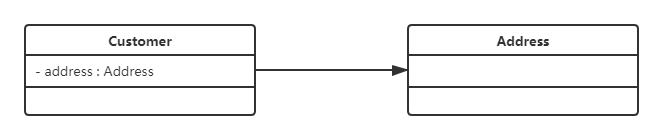
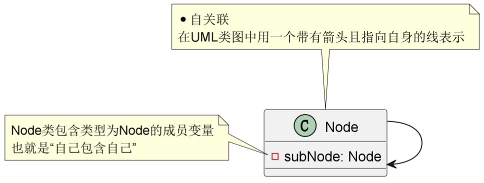

# 1、UML

**英译**
(Unified Modeling Language)

**什么是UML**
1、是用来设计软件的可视化建模语言，又称统一建模语言或标准建模语言。
2、UML从目标系统的不同角度出发，定义了【用例图、类图、对象图、状态图、活动图、时序图、协作图、构件图、部署图】等9种图。

**UML的作用**
为了简单、统一，以图形化的方式表达软件设计中的动态与静态信息。
通过使用 UML 的面向对象图的方式，可以更明确、清晰的表达项目中的架设思想、项目结构、执行顺序等一些逻辑思维。

# 2、类图

**英译**
(Class Diagram)

**什么是类图**
类图是显示了模型的静态结构，特别是模型中存在的类、类的内部结构以及它们与其他类的关系等。类图不显示暂时性的信息。类图是面向对象建模的主要组成部分。

**类图的作用**
1、软件工程中，类图是一种静态的结构图，描述了系统的类的集合，类的属性和类之间的关系，可以简化了人们对系统的理解；
2、类图是系统分析和设计阶段的重要产物，是系统编码和测试的重要模型。

**类图中类的表示方式**
在UML类图中，类使用包含类名、属性(field) 和方法(method) 且带有分割线的矩形来表示，比如下图表示一个Employee类，它包含name,age和address这3个属性，以及work()方法。

属性/方法名称前加的加号和减号表示了这个属性/方法的可见性，UML类图中表示可见性的符号有三种：

* +：表示public
* -：表示private
* ：表示protected

属性的完整表示方式是： **可见性 名称 ：类型 [ = 缺省值]**
方法的完整表示方式是： **可见性 名称(参数列表) [ ： 返回类型]**

>  1，中括号中的内容表示是可选的
>  2，也有将类型放在变量名前面，返回值类型放在方法名前面

上图Demo类定义了三个方法：
method()方法：修饰符为public，没有参数，没有返回值。
method1()方法：修饰符为private，没有参数，返回值类型为String。
method2()方法：修饰符为protected，接收两个参数，第一个参数类型为int，第二个参数类型为String，返回值类型是int。

# 3、类图-关联关系

关联关系是对象之间的一种引用关系，用于表示一类对象与另一类对象之间的联系，如老师和学生、师傅和徒弟、丈夫和妻子等。关联关系是类与类之间最常用的一种关系，分为一般关联关系、聚合关系和组合关系。

## 1、单向关联

在UML类图中单向关联用一个带箭头的实线表示。上图表示每个顾客都有一个地址，这通过让Customer类持有一个类型为Address的成员变量类实现。

## 2、双向关联

从上图中我们很容易看出，所谓的双向关联就是双方各自持有对方类型的成员变量。

在UML类图中，双向关联用一个不带箭头的直线表示。上图中在Customer类中维护一个List\<Product>，表示一个顾客可以购买多个商品；在Product类中维护一个Customer类型的成员变量表示这个产品被哪个顾客所购买。

## 3、自关联

自关联在UML类图中用一个带有箭头且指向自身的线表示。上图的意思就是Node类包含类型为Node的成员变量，也就是“自己包含自己”。
如其成员变量：private List\<Node> subNode;

# 4、类图-聚合关系

聚合关系是关联关系的一种，是强关联关系，是整体和部分之间的关系。

聚合关系也是通过成员对象来实现的，其中成员对象是整体对象的一部分，但是成员对象可以脱离整体对象而独立存在。例如，学校与老师的关系，学校包含老师，但如果学校停办了，老师依然存在。

在 UML 类图中，聚合关系可以用带空心菱形的实线来表示，菱形指向整体。下图所示是大学和教师的关系图：

# 5、类图-组合关系

组合表示类之间的整体与部分的关系，但它是一种更强烈的聚合关系。

在组合关系中，整体对象可以控制部分对象的生命周期，一旦整体对象不存在，部分对象也将不存在，部分对象不能脱离整体对象而存在。例如，头和嘴的关系，没有了头，嘴也就不存在了。

在 UML 类图中，组合关系用带实心菱形的实线来表示，菱形指向整体。下图所示是头和嘴的关系图：

# 6、类图-依赖关系

依赖关系是一种使用关系，它是对象之间耦合度最弱的一种关联方式，是临时性的关联。在代码中，某个类的方法通过局部变量、方法的参数或者对静态方法的调用来访问另一个类（被依赖类）中的某些方法来完成一些职责。

在 UML 类图中，依赖关系使用带箭头的虚线来表示，箭头从使用类指向被依赖的类。下图所示是司机和汽车的关系图，司机驾驶汽车：

# 7、类图-继承关系

继承关系是对象之间耦合度最大的一种关系，表示一般与特殊的关系，是父类与子类之间的关系，是一种继承关系。

在 UML 类图中，泛化关系用带空心三角箭头的实线来表示，箭头从子类指向父类。在代码实现时，使用面向对象的继承机制来实现泛化关系。例如，Student 类和 Teacher 类都是 Person 类的子类，其类图如下图所示：

# 8、类图-实现关系

实现关系是接口与实现类之间的关系。在这种关系中，类实现了接口，类中的操作实现了接口中所声明的所有的抽象操作。

在 UML 类图中，实现关系使用带空心三角箭头的虚线来表示，箭头从实现类指向接口。例如，汽车和船实现了交通工具，其类图如图所示。

# 9、plantUML

**简介**
plantUML是一个开源绘图工具，一个用来绘制UML图的Java类库，支持通过文本来生成图形。
plantUML是一种UML建模语言，可以让我们以写代码的方式画出UML建模图，同时使用文本也方便版本控制。
plantUML具备相对完善的中文支持网站：https://plantuml.com/zh/class-diagram

**插件**
在插件市场搜索plantUML并安装即可。

**创建puml文件**
在IDEA中，插件安装完毕后，右键即可新建puml文件。

**使用**
puml类图语法以 @startuml开始、@enduml结束，中间穿插其自身语法，常用语法如下。

# 10、puml-关联关系

## 1、单向关联

## 2、双向关联

## 3、自关联

# 11、puml-聚合关系 

# 12、puml-组合关系

# 13、puml-依赖关系

# 14、puml-泛化关系

# 15、puml-实现关系

