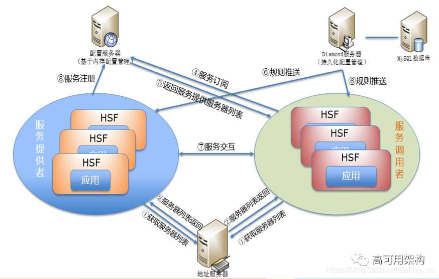
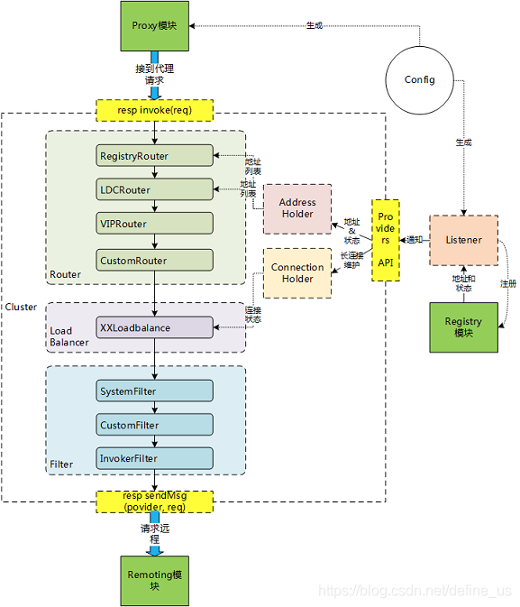
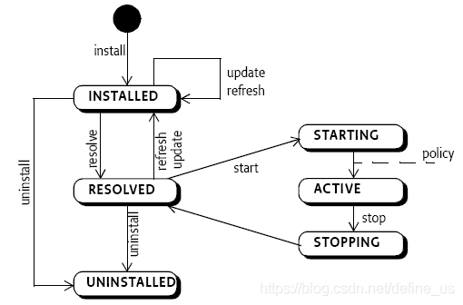
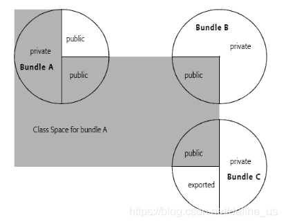

> **初识 sofa 分布式架构**

## **历史**

阿里集团内部使用最广泛的系统，也就是所谓的“好舒服”HSF。



SOFA最重要的缺点是过于重量级。但是对应的优点就是功能非常的完善。

## RPC

作为一个标准的服务注册流程。首先，当一个 SOFA RPC 的应用启动的时候，如果发现当前应用需要发布 RPC 服务的话，那么 SOFA RPC 会将这些服务注册到配置中心上，就是图中蓝线所示的过程。
接着，当引用这个服务的 SOFA 应用启动时，会从配置中心订阅对应服务的地址
然后，当配置中心收到订阅请求后，会将发布方的地址列表推送给订阅方，就是图中绿线所示的过程。
最后，当引用服务的一方拿到地址以后，就可以发起直连调用服务了，就是图中蓝色虚线的部分。



sofa提供四种调用方式

- 同步调用
- OneWay方式
- Future方式
- Callback方式

## 启动流程

sofa的每个模块（原来的buddle概念）都有自己独立的Spring环境。不指定的话完全隔离。需要使用sofa自由的标签来发布和引用服务。
sofa虽然是一个不常见的系统，但是其应用也无非是一个主类。即com.alipay.cloudengine.launcher里面存在的Main方法。
其应用部署在/home/admin/project/deploy目录下的ace文件。

ace文件目录如下：

- cloudengine-plugins: ace 插件
- config：工程配置文件
- core：工程 core 依赖包
- lib：工程 lib 依赖包
- META-INF

Cloudengine 在自身的 Bundle 加载完毕之后，就会加载业务系统。
（1）从自身的jar包中解压出来cloudengine.zip并进行部署。
（2）启动OSGI Framework时，会加载120个基础Bundles

## 应用架构

首先总结下缺点
在 sofa4 时代，由于外置容器的存在，编译时和运行时是割裂的。这意味着你不能以java -jar XXX.jar。这导致你本地不可能完全模拟服务器上的情况。SOFA4你甚至找不到Main方法。CE基于OSGi机制进行的隔离，也是非常痛苦的存在。我的业务就是很小的东西，为什么要提供还要做模块间的隔离呢？所以，后续的中间件团队提供了更加类似SpringBoot的SofaBoot。其实，在我看来，这似乎已经违背了初心了。OSGi的机制有一个先天的优势（所谓的隔离只是骗骗我们这些天真的码农，不隔离的代码多了，日子不过了？）就是

```java
public void start(String appType, String[] testBundleName, String[] configPattern, boolean enableRemoteTestInnerBean) {
        ClassPathUtil.changeOrderOfUCP();
        if (!started) {
            try {
                if (configPattern == null) {
                    configPattern = new String[]{"/sofaconfig/", "/**/*.*"};
                }            
			TestUtils.initSofaConfig(configPattern);
            this.iniSystemProperties();
            TestUtils.setUpCloudEngineIfNecessary(2);
            this.createAce(appType, enableRemoteTestInnerBean);
            this.createFramework(appType);
            this.installAndStartTestBundle(testBundleName);
            started = true;
        } catch (Exception var6) {
            System.err.println("启动失败!");
            var6.printStackTrace();
            if (var6 instanceof RuntimeException) {
                throw (RuntimeException)var6;
            }

            throw new RuntimeException("启动失败!", var6);
        }
    }

}
```
CloudEngine是蚂蚁自己研究的应用服务器。这个是基于Equinox的魔改。Equinox是大名鼎鼎的 Eclipse 所使用的 OSGi 框架。在应用服务器里运行的模块被成为bundle。一个bundle至少要有这种基本属性

- MANIFEST.MF
- 代码
- 资源
  无论是CloudEngine还是Equinox，目标平台都已经为你装载一部分bundle了。他们提供各种服务。我们称他们为system bundle。
  对于Equinox，bundle的装入要进行如下步骤

1. 读入 bundle 的 headers 信息，即 MANIFEST.MF 文件；
2. 装载相关的类和资源；
3. 解析依赖的包；
   4.调用其 Activator 的start方法，启动它；
4. 为其提供框架事件、服务事件等服务；
5. 调用其 Activator 的stop方法，停止它；

一个bundle有如下状态和状态图





bundle 的 MANIFEST.MF 文件提供了 EXPORT/IMPORT package 的关键字，这样您可以仅仅 export 出您希望别人看到的包，而隐藏实现的包。并且您可以为它们编上版本号，这样可以同时发布不同版本的包。
类加载器的搜索路径为

* 首先，它会找 JRE，这个很明显，这个实际是通过系统环境的JAVA_HOME中找到的，路径一般是 JAVA_HOME/lib/rt.jar、tools.jar 和 ext 目录，endorsed 目录。
* 其次，它会找 system bundle 导出的包。
* 然后，它会找您的 import 的包，这个实际包含两种：一种是直接通过 require-bundle 的方式全部导入的，还有一种就通过 import package 方式导入的指定包（可以指定版本）。
  查找它的 fragment bundle，如果有的话。
* 如果还没有找到，则会找自己的 classpath 路径（每个 bundle 都有自己的类路径）。
* 最后它会尝试根据 DynamicImport-Package 属性查找的引用。

OSGI framework提供了一个osgi service registry，我们可以将一个java bean注册到这个osgi service registry上，然后，其它的bundle就可以通过osgi service registry来发现和引用这个Java bean，而这个Java bean就是一个OSGI Service（OSGI服务）了。
